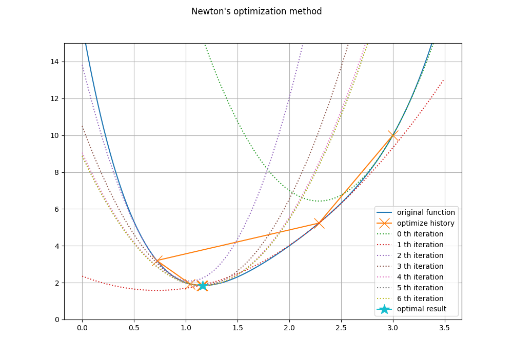

# mathematical optimization

This repository contains python implementation of mathematical optimization methods.

## Newton's method(for optimization)

[newton_method.py](newtons_method/newton_method.py)

